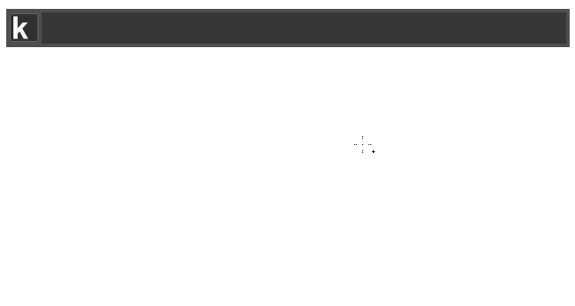

# Keypirinha Plugin: gitmoji

This is gitmoji, a plugin for the
[Keypirinha](http://keypirinha.com) launcher.

Search for [gitmoji](https://github.com/carloscuesta/gitmoji) and copy them to your clipboard. Include them in your commit messages to a better way of identifying the purpose of a commit.

## Download

https://github.com/Fuhrmann/keypirinha-gitmoji/releases

## Install

#### Managed

[@ueffel](https://github.com/ueffel) wrote [PackageControl](https://github.com/ueffel/Keypirinha-PackageControl), a package manager that eases the install of third-party packages.
It must be installed manually.

#### Manual

Once the `gitmoji.keypirinha-package` file is installed,
move it to the `InstalledPackage` folder located at:

* `Keypirinha\portable\Profile\InstalledPackages` in **Portable mode**
* **Or** `%APPDATA%\Keypirinha\InstalledPackages` in **Installed mode** (the
  final path would look like
  `C:\Users\%USERNAME%\AppData\Roaming\Keypirinha\InstalledPackages`)

## Usage

Open Keypirinha and type 'gitmoji'. Once the suggestion appears press TAB or ENTER to open all suggestions.

## Change Log

### v1.0
* Released

## License

This package is distributed under the terms of the MIT license.

## Credits
[@carloscuesta](https://github.com/carloscuesta), developer of [gitmoji](https://github.com/carloscuesta/gitmoji)

[@leolabs](https://github.com/leolabs), developer of [gitmoji for Alfred](https://github.com/leolabs/alfred-gitmoji/)